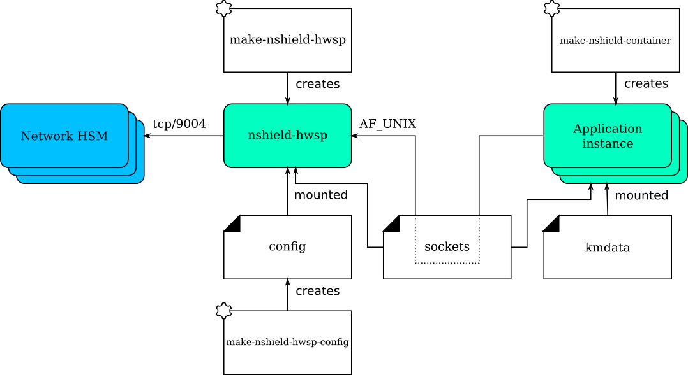
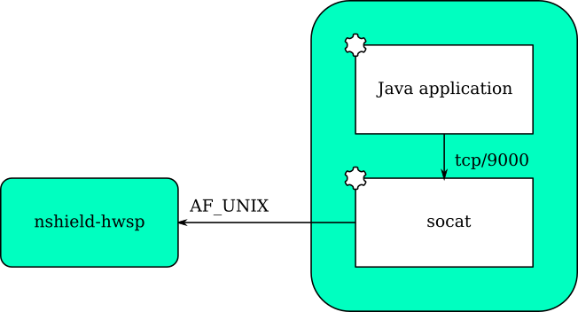

# nShield Container Option Pack

Document Version: 1.1.1
Date: 7 May 2021

Copyright © 2021 nCipher Security Limited. All rights reserved.

Copyright in this document is the property of nCipher Security Limited. It is not to be reproduced
modified, adapted, published, translated in any material form (including storage in any medium by
electronic means whether or not transiently or incidentally) in whole or in part nor disclosed to
any third party without the prior written permission of nCipher Security Limited neither shall it
be used otherwise than for the purpose for which it is supplied.

Words and logos marked with ® or ™ are trademarks of nCipher Security Limited or its affiliates in
the EU and other countries.

Docker and the Docker logo are trademarks or registered trademarks of Docker, Inc. in the United
States and/or other countries.

Information in this document is subject to change without notice.

nCipher Security Limited makes no warranty of any kind with regard to this information, including,
but not limited to, the implied warranties of merchantability and fitness for a particular purpose.
nCipher Security Limited shall not be liable for errors contained herein or for incidental or
consequential damages concerned with the furnishing, performance or use of this material.

Where translations have been made in this document English is the canonical language.

nCipher Security Limited  
Registered Office: One Station Square,  
Cambridge, CB1 2GA, United Kingdom  
Registered in England No. 11673268

**PLEASE NOTE**: For nSCOP version 1.1 and later, please refer to the nSCOP User Guide for the most up to date information.

## 1. Introduction

The nShield Container Option Pack (nSCOP) provides application developers, within a container-based
environment, the ability to access the cryptographic functionality of an nShield Connect HSM. This
release of nSCOP has been tested with Docker containers.

The nShield Container Option Pack is installed on top of your existing Security World Software
installation, allowing you to continue using your existing Security World and keys.

## 2. Software Prerequisites

The nShield Container Option Pack requires nShield Security World Software and Docker to be
installed prior to the use of the nShield Container Option Pack scripts. nSCOP has been tested with
Security World v12.40, v12.60, and 12.70, and Docker Engine 19.03.

Before you can begin using nSCOP you must complete the following steps:

1. Setup the nShield Connect(s) as per the Installation Guide.
2. Configure the nShield Connect(s) to have the IP address of your container host machine configured as a
client of the nShield Connect.

The container host machine is the machine on which you will build and run the nShield hardserver and application
containers.

To access and use cryptographic keys from within a Security World you will need to load or create a
Security World on the nShield Connect and map the key management data folder (kmdata) from your
container host machine into the running application containers.

For further information on configuring and managing nShield Connects, Security Worlds and Remote
File Systems, please consult the nShield Connect User Guide supplied with your Security World
software.

When using `podman` on Red Hat Enterprise Linux, you should install the `podman-docker` package
to provide the Docker alias. nSCOP has been tested with `podman-docker v1.6.4`.

## 3. Installation

To install the nShield Container Option Pack:

1. Create the directory where you wish to install nSCOP, e.g. `mkdir -p /opt/nscop`
2. Untar the option pack to this directory: `tar xf nscop-1.1.1.tar -C /opt/nscop`

You should ensure that any users that will use the nShield Container Option Pack scripts have
permission to execute the installed scripts and run Docker.

The following Bash scripts are provided in this Option Pack.

| Script                     | Purpose |
| :---                       | :---    |
| make-nshield-hwsp          | Make an nShield hardserver Docker image |
| make-nshield-hwsp-config   | Generates a hardserver configuration file for an nshield-hwsp container |
| make-nshield-application   | Create a new Docker image with the nShield support software installed  |
| extend-nshield-application | Install the nShield support software to an existing Docker image |

### 3.1 Uninstalling the nShield Container Option Pack

To uninstall, delete the directory containing the nShield Container Option Pack from your system.

You should remove any built Docker images and/or containers from your system if they are no longer
needed. Consult the documentation for Docker on how to delete Docker images and containers.

## 4. Deployment Architecture

The `nshield-hwsp` container runs the hardserver. It is supplied with configuration to connect to
one or more network HSMs (nShield Connects). It exposes the hardserver via an `AF_UNIX` socket.
Access to the hardserver socket must be restricted to trusted users.

Application instances are any containers that include applications that use the nShield software
stack. They are supplied with the socket used to connect to the hardserver and access to the key
management data files (to use the World and associated cryptographic keys).

The key management data files, including encrypted copies of keys, are located in kmdata. A
container mounting kmdata as a volume will be able to spoof the nShield Connect client. Therefore,
access to files in kmdata must be controlled and restricted to trusted users.

## 5. The Hardserver Container

The hardserver container, `nshield-hwsp`, controls communication between the configured nShield
Connect/s and application containers. Only one hardserver container is required per deployment,
regardless of the number of nShield Connects or application containers.

#### 5.1 Creating `nshield-hwsp`

`make-nshield-hwsp` can be used to create the hardserver container. The only required argument is
the path to a mounted nShield Security World ISO.

For example:

    $ mkdir SecWorld-12.70.4
    $ sudo mount -o loop SecWorld_Lin64-12.70.4.iso SecWorld-12.70.4
    mount: /dev/loop0 is write-protected, mounting read-only
    $ make-nshield-hwsp SecWorld-12.70.4
    [...]
    Successfully tagged nshield-hwsp:12.70.4

The default base image for nShield hardserver containers is RedHat UBI7. The default tag
reflects the version of nShield Security World software that the container was built from.

If you want to use a different base image, or specify a different tag, use the `--from` and `--tag`
options. See `make-nshield-hwsp --help` for more information.

##### 5.1.1 Users and Groups

By default the `nfast` user and group in the container will match those on the host machine; you should 
create them if they do not exist on the host, or if this is a bad fit for deployment the `--uid` and `--gid`
options should be used to set them instead.

#### 5.2 Configuring `nshield-hwsp`

`make-nshield-hwsp-config` can be used to create the hardserver container's configuration (the
"config" component in the Deployment Architecture diagram).

* Use the `--output` option to specify the filename.
* List IP addresses of network HSMs on the command line.

Different configuration files can be used for different container deployments.

Running the following example requires the nShield support software installed on the host; you can alternatively
create the config file based on the template below by simply filling in the esn/ip/port/keyhash values in the
nethsm_imports section.

For example:

    $ sudo mkdir -p /opt/nscop/config1
    $ sudo make-nshield-hwsp-config --output /opt/nscop/config1/config 192.168.0.10
    $ cat /opt/nscop/config1/config
    syntax-version=1

    [nethsm_imports]
    local_module=1
    remote_esn=1111-2222-3333
    remote_ip=192.168.0.10
    remote_port=9004
    keyhash=000102030405060708090a0b0c0d0e0f10111213
    privileged=0

Module numbers are assigned in order.

Note that key hash values are retrieved from remote HSMs without any trust; the generated
configuration file should be compared against values recorded from the front panel, or some other
trusted path.

#### 5.3 Running `nshield-hwsp`

To run the hardserver container, you must:

* Supply the generated hardserver configuration to the container.
* Mount a volume for the /opt/nfast/sockets folder.
* Mount a volume for the /opt/nfast/sockets-priv folder, if required.

This can be done with the `-v` option.
For example, using a Docker volume for the /opt/nfast/sockets folder:

    $ docker volume create socket1
    $ docker run \
        -v /opt/nscop/config1:/opt/nfast/kmdata/config:ro \
        -v socket1:/opt/nfast/sockets \
        nshield-hwsp:12.70.4
    Hardserver INIT: Notice: Hardserver using priority class queueing algorithm: 0 classes and 0 modules total.
    [...]

This makes `nshield-hwsp`'s hardserver available via the sockets in the Docker volume socket1. If the nShield support
software is installed, this can be tested from the host:
First obtain the mount point for the Docker volume and use this for the NFAST_SERVER environment variable:

    $ docker volume inspect --format '{{ .Mountpoint }}' socket1
    /var/lib/docker/volumes/socket1/_data

    $ NFAST_SERVER=/var/lib/docker/volumes/socket1/_data/nserver /opt/nfast/bin/enquiry -m0
    Server:
     enquiry reply flags  none
     enquiry reply level  Six
     serial number        1111-2222-3333
     mode                 operational
     version              12.70.4
    [...]

## 6. Application Containers

An nShield application container is a container with the nShield Security World software installed.

Two strategies for creating nShield application containers are supported:

* Create an nShield base container, and derive application containers from it.
* Derive a container with nShield Security World software from an existing application container.

### 6.1 nShield base container

The base container can be created using `make-nshield-application`. The only required argument is
the path to a mounted Security World ISO.

    $ make-nshield-application SecWorld-12.70.4
    [...]
    Successfully tagged nshield-ubi7:12.70.4

To run the base application container, you must:
* Supply a kmdata folder (if you wish to perform operations that require a Security World).
* Mount a volume for the sockets folder.

Both can be done with the -v option. 
Different application containers can use different kmdata folders. For example, you could create a new folder 

    $ mkdir –p /opt/nscop/app1/kmdata/local

You can then copy the desired Security world and module files for your application into this folder. 

Using this folder and the Docker volume created for the hardserver container in section 5.3 above, this container can be run directly:

    $ docker run -it \
        -v /opt/nscop/app1/kmdata:/opt/nfast/kmdata:ro \
        -v socket1.hwsp:/opt/nfast/sockets \
        nshield-ubi7:12.70.4
    [root@075c41761e0f /]# /opt/nfast/bin/enquiry
    Server:
     enquiry reply flags  none
     enquiry reply level  Six
     serial number        1111-2222-3333
    [...]

It can also be used as the base for an application container.
(See [examples/nfkminfo](examples/nfkminfo).)

The default base image for nShield application containers is RedHat UBI7. The default tag
reflects the version of nShield Security World software that the container was built from.

If you want to use a different base image, or specify a different tag, use the `--from` and `--tag`
options. See `make-nshield-application --help` for more information. nShield application containers
have been tested with the following base images:
* RedHat UBI 7/8 (including "minimal")
* CentOS 7/8
* Ubuntu Bionic 18.04
* Ubuntu Focal 20.04
* Debian Stretch 9 (including slim)
* Debian Buster 10 (including slim)
* OpenSUSE 15.1/2
* Alpine (frolvlad-glibc)
* Nginx 1.18
* Apache 2.4.43

Other base images may work but are untested.

#### 6.1.1 API Support (CHIL, Java, PKCS#11)

Depending on the application's requirements, additional components may be installed. The possible
options are `--chil`, `--java` and `--pkcs11`. Any combination is allowed.

    $ make-nshield-application --java SecWorld-12.70.4
    [...]
    Successfully tagged nshield-ubi7:12.70.4-java

The set of supported APIs is appended to the nShield software version in the container tag.

API support is dependant on the version of nShield software used. Note that with Security World
v12.60 onward, PKCS11 is included by default and is not configurable with the nSCOP scripts, 
and CHIL is not supported. With earlier versions you can configure any combination of APIs.

#### 6.1.2 Java applications

Java applications expect to connect to localhost:9000. This must therefore be forwarded to the
hardserver socket.

`/opt/nfast/sbin/nshield-forward` implements this forwarding and is included in any container built
using the `make-nshield-application` or `extend-nshield-application` scripts. This utility depends
on `socat` being installed in the application container. The nShield base container includes
`socat` but `extend-nshield-application` will not install it. You must install it yourself.

### 6.2 Deriving from application containers

The alternative strategy is to build the application container and then install the nShield support
software into it. This can be done with `extend-nshield-application`. This strategy might be
preferred if the application container already exists or if it supports many cryptographic backends
with nShield being just one choice.

See [examples/nfkmverify](examples/nfkmverify) for an example use of `extend-nshield-application`.

### 6.3 Example applications

A set of example application containers are provided within the [examples](examples) directory.

For further information on building and running the examples, see the Readme within each example
directory.

| Example                             | Description |
| :---                                | :---    |
| [nfkminfo](examples/nfkminfo)       | Simple example of running an nShield application in an application container created using `make-nshield-application` |
| [javaenquiry](examples/javaenquiry) | Example Java application where the the application container is derived from the nShield Java container using `make-nshield-application` |
| [nfkmverify](examples/nfkmverify)   | Example where the application container is extended from an existing container to add nShield Container using `extend-nshield-application` |
| [nfweb](examples/nfweb)             | Example web server exposing basic information about the connected nShield modules |
